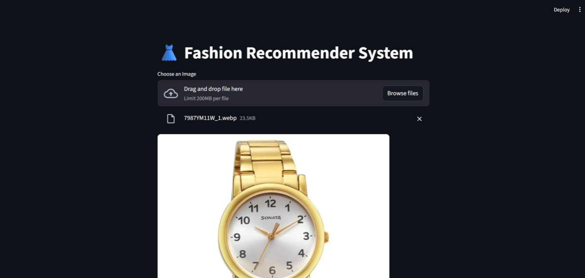

# FASHION RECOMMENDATION SYSTEM
_Suggests personalized fashion recommendation system suggesting outfits based on user preferences and style trends._

---

## 📌 Table of Contents
- <a href="#Overview">Overview</a>
- <a href="#tools--technologies">Tools & Technologies</a>
- <a href="#project-structure">Project Structure</a>
- <a href="#data-cleaning--preparation">Data Cleaning & Preparation</a>
- <a href="#exploratory-data-analysis-eda">Exploratory Data Analysis (EDA)</a>
- <a href="#dashboard">Dashboard</a>
- <a href="#how-to-run-this-project">How to Run This Project</a>
- <a href="#final-recommendations">Final Recommendations</a>
- <a href="#author--contact">Author & Contact</a>

---
<h2><a class="anchor" id="overview"></a>Overview</h2>

This fashion recommendation system leverages a dataset of 44,000 images along with user preferences and style trends to provide personalized outfit and accessory suggestions. Using data-driven algorithms, it analyzes patterns in clothing styles to help users discover items that match their taste and keep up with current fashion trends.

---
<h2><a class="anchor" id="tools--technologies"></a>Tools & Technologies</h2>

- Python (NumPy, Pandas, Tensorflow, Sk-learn)
- Streamlit (Interactive Visualizations)
- GitHub

---
<h2><a class="anchor" id="project-structure"></a>Project Structure</h2>

```
Olympics-Analysis(1896-2016)/
│
├── README.md
├── .gitignore
├── scripts/                    # Python scripts for ingestion and processing
│   ├── app.py
│   └── main.py
│   └── test.py
```

---
<h2><a class="anchor" id="data-cleaning--preparation"></a>Data Cleaning & Preparation</h2>

- Removed duplicate or corrupted images from the dataset.
- Resized all images to a consistent dimension for uniform processing.
- Normalized pixel values to improve model training efficiency.
- Labeled images according to categories, styles, or attributes.
- Split dataset into training, validation, and test sets.
- Handled missing or inconsistent metadata (e.g., style tags, color info).
- Applied data augmentation (rotation, flipping, cropping) to increase dataset diversity

---
<h2><a class="anchor" id="exploratory-data-analysis-eda"></a>Exploratory Data Analysis (EDA)</h2>

- Visualized the distribution of clothing categories and styles.
- Analyzed color trends and patterns across the dataset.
- Examined the frequency of different clothing attributes (e.g., sleeve type, patterns, fabric).
- Checked class balance to identify underrepresented categories.
- Explored correlations between style attributes and user preferences.
- Sampled images to validate labeling and dataset quality.

---
<h2><a class="anchor" id="dashboard"></a>Dashboard</h2>

- Streamlit Dashboard shows:
    - Drag & Drop 
    - File Uploaded
    - How Many Recommendations (upto 20)


---
<h2><a class="anchor" id="how-to-run-this-project"></a>How to Run This Project</h2>

1. Clone the repository:
```bash
git clone https://github.com/noturbhavya/Fashion-recommendation-system
```
3. Load the dataset and ingest into database:
```bash
python app.py
```
4. Open Terminal and run:
   - `python -m streamlit run app.py`

---
<h2><a class="anchor" id="final-recommendations"></a>Final Recommendations</h2>

- Expand the dataset with more diverse images to improve recommendation accuracy.
- Incorporate user feedback to refine and personalize suggestions over time.
- Experiment with advanced deep learning models (e.g., CNNs, Vision Transformers) for better feature extraction.
- Integrate seasonal and trending fashion data for timely recommendations.
- Enhance the system with multi-modal inputs (e.g., text descriptions, user reviews) for richer suggestions.
- Implement real-time recommendation updates based on user interactions.

---
<h2><a class="anchor" id="author--contact"></a>Author & Contact</h2>

**Bhavya Patela**
Data Scientist
📧 Email: bhavyapatela100@gmail.com
🔗 [LinkedIn](https://www.linkedin.com/in/bhavya-patela-526a38322/)